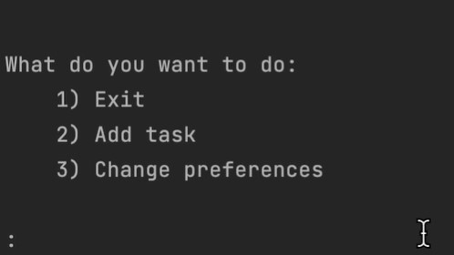
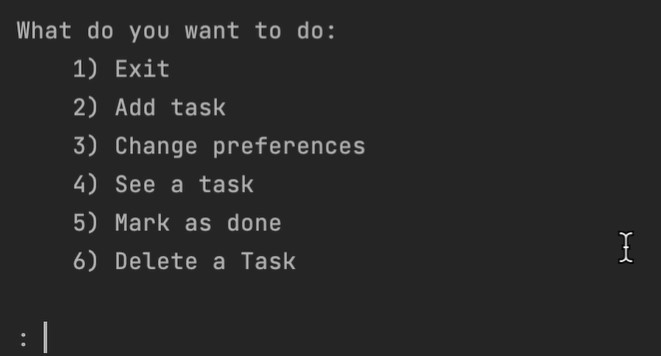

# ADS Final Project - Task Manager for Students & Professionals
Repository for the final project of ADS. IEU 2022

## Table of Contents:
 - What the project does;
 - Why the project is useful;
 - How users can get started with the project;
 - Where users can get help with our project;
 - Who maintains and contributes to the project;
 - Other specifications;

------------------------------------------------------------

## What the project does:

This app lets you add, delete, and manage tasks to help you organize time better.

At first, you are prompted to add a task, which means that you add the task's title, due date, and the estimated number of hours it will take you to complete said task, or, you can change your preferences before adding tasks (see below).

After that, you have the freedom to add additional tasks, change deadlines and the estimated hours to complete as well as the title, or, you also have the possibility of deleting a task or marking it as done.

**Preferences:**

Moreover, there are also preferences which you can change. You can change the "frequency" of the tasks and you have two options: "long" frequency or "short" frequency. "Long" frequency means that your tasks will be distributed in fewer sittings but each sitting will take a longer time, while "short" frequency means that you will have a larger number of study/work sittings, but each sitting will take a shorter amount of time.

There is additionally the possibility to change the maximum study time per day.

Another preference you can change is the "distribution" of the tasks and you have two options: "fill" distribution or "spread" distribution". The "fill" distribution will distribute the tasks in a way that your maximum study time per day is always met (if, of course, you have sufficient tasks and hours to work on), which in essence means that each day you will have to work more (your max study time) but you will complete the tasks sooner rather than later (there is also prioritization to account for deadlines). However, if, on the other hand, you choose the "spread" distribution, then, according to deadlines, your tasks will be spread among the days - you will likely work less per day but you will have to work everyday. 

-----------------------------------------------------------

## Why the project is useful:

The project is useful because you don't have to worry about time management if you start using this program. Simply by inputting all the tasks you have to do and their deadline, and correctly estimating the time it will take to do each task, everything is planned for you and you just have to follow what you're told. Not only that, you can work in the way YOU like to work by adjusting the preferences.

-----------------------------------------------------------

## How users can get started with the project:

Simply by downloading the files, and running the main.py file.

It must be kept in mind that all the downloaded files must be in the same directory (folder).

----------------------------------------------------------

## Where users can get help with our project:

By contacting any of the contributors (see contact information below).

----------------------------------------------------------

## Who maintains and contributes to the project:

jmurillo.ieu2021@student.ie.edu

ejansons.ieu2021@student.ie.edu

fvagnoni.ieu2021@student.ie.edu

hhelmrich.ieu2021@student.ie.edu

pgomez.ieu2021@student.ie.edu

vmiguel.ieu2021@student.ie.edu

----------------------------------------------------------

## Other specifications

**OS used:** Windows 11, MacOS 12

**Python version:** Python 3.11

**Libraries used:** None

